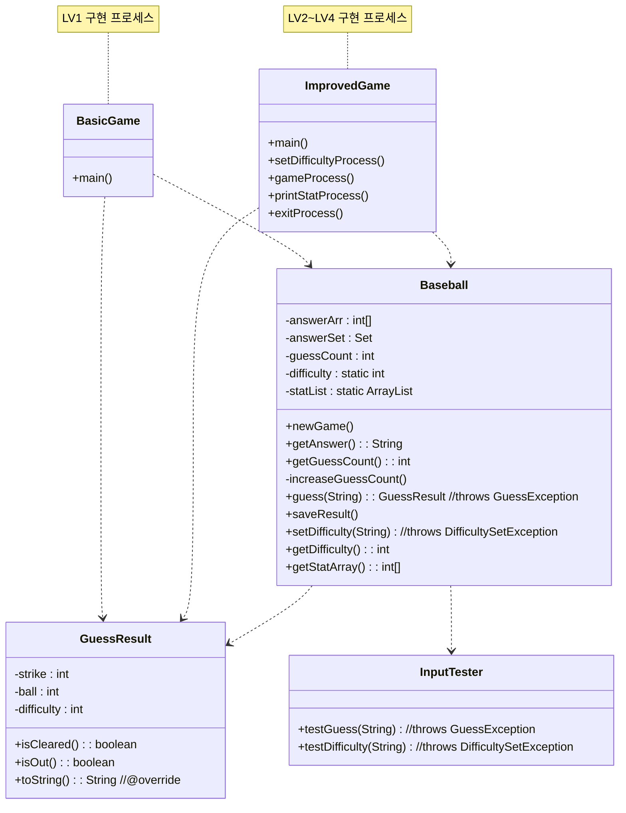

# baseball

---
java 객체지향 숙달을 위해 구현된 숫자 야구 게임 과제입니다.

## 동작 방식

---
콘솔 창에서 숫자 야구 게임을 실행시키기 위한 두 프로세스가 있습니다.
- __BasicGame__: 기본 난이도 게임을 1회 수행합니다.
- __ImprovedGame__: 아래의 기능을 지원합니다.
  - 게임 난이도 선택: 3~5의 자리수 선택 가능
  - 게임 시작: 선택한 난이도로 게임을 시작합니다. 기본 난이도는 3자리입니다.
  - 통계 확인: 현재 프로세스에서 수행한 이전 게임의 시도 횟수를 출력합니다.
  - 종료: 프로세스를 종료합니다.

각 숫자 야구 게임 시행은 다음 규칙을 갖습니다.
- 지정된 자리수만큼 1~9의 중복 없는 수열이 임의로 정해집니다.
- 플레이어는 조건에 맞는 숫자를 입력하여 추측 시도를 합니다.
- 추측의 Strike 와 Ball 갯수 또는 Out 여부가 출력됩니다.
- 추측이 성공적일 경우, 기록을 통계에 저장하고 종료됩니다.

## 프로젝트 구조

---
```text
\src\com\sparta\baseball
│   BasicGame.java
│   ImprovedGame.java
│   README.md
│   
├───DataType
│       GuessResult.java
│       
├───Exceptions
│       DifficultySetException.java
│       GuessException.java
│       
└───Main
        Baseball.java
        InputTester.java
```
`pwsh tree /f로 작성`

## 클래스 다이어그램

---


## 문서

---
[설계 & 트러블 슈팅](https://mdworld.notion.site/3-39bac062aa284ca59bb23031f9810b6c?pvs=4)

